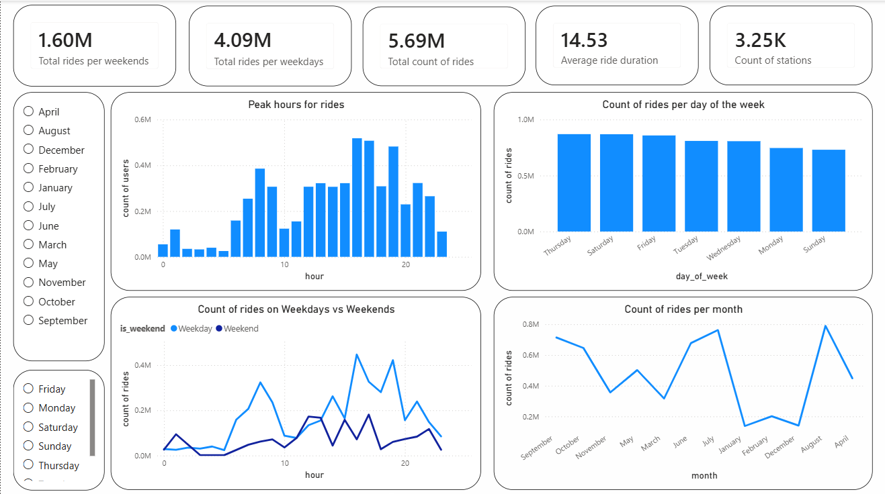
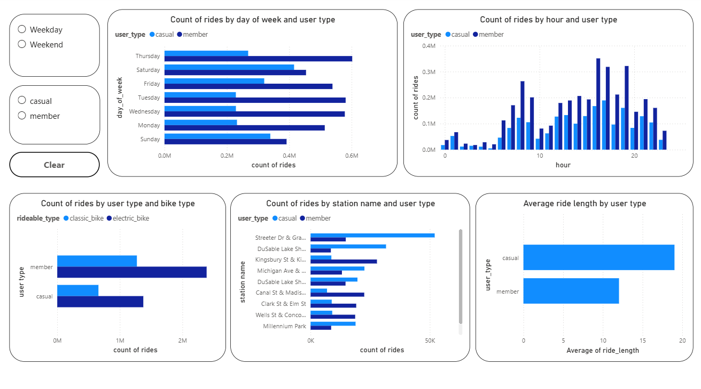
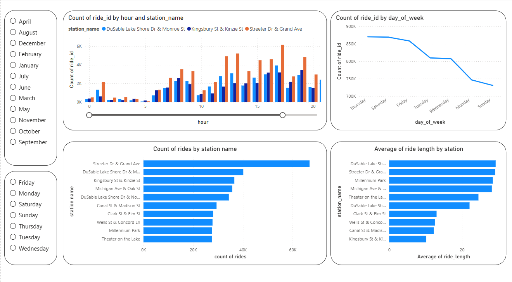

# Cyclistic Bike-Share Analysis
<p float="left">
  
  
  
</p>

## Project Overview

This project analyzes the Cyclistic Bike-Share dataset with the objective of identifying behavioral differences between casual riders and annual members. The ultimate business goal is to provide data-driven insights that can help convert casual riders into membership subscribers.

The project covers the complete analytics workflow, including data cleaning, data modeling, data warehouse design, ETL processes, and dashboard development.

---

## Business Objective

Cyclistic's marketing team aims to increase the number of annual memberships. To support this objective, this analysis focuses on understanding:

* How casual riders and members use the bike-sharing service differently.
* When and where each customer segment rides most frequently.
* Which behavioral patterns can be leveraged to encourage casual users to become members.

---

## Dataset

The original Cyclistic dataset contains multiple years of historical trip data.

For this project:

* One year of trip data was selected and merged into a single dataset.
* Data quality checks and cleaning procedures were performed.
* Additional calculated attributes were created to support business analysis.

---

## Data Preparation

### Data Cleaning

The following preprocessing steps were performed:

* Merged monthly datasets into a unified dataset.
* Removed duplicates and invalid records.
* Handled missing values where appropriate.
* Standardized column formats and data types.
* Created derived columns for analytical purposes.

### Feature Engineering

Additional fields were generated, including:

* Ride Duration
* Day of Week
* Month
* Hour of Day
* Weekend Indicator
* Other analytical attributes used in reporting

---

## Data Warehouse Design

A dimensional data warehouse was designed following a star schema approach.

### Data Modeling

The project includes:

* Conceptual Data Model
* Logical Data Model
* Physical Data Model

### Data Warehouse Components

#### Fact Table

* fact_bike_trips

#### Dimension Tables

* dim_date
* dim_station
* dim_rideable_type
* dim_user_type

---

## ETL Process

Python was used to perform the ETL workflow:

1. Extract data from source files.
2. Transform and clean the data.
3. Populate dimension tables.
4. Load fact and dimension tables into SQL Server.

Technologies used:

* Python
* Pandas
* NumPy
* SQLAlchemy
* SQL Server 

---

## Database

The data warehouse was implemented using Microsoft SQL Server.

Key tasks:

* Creating warehouse tables.
* Defining primary and foreign keys.
* Loading transformed data into fact and dimension tables.

---

## Data Visualization & Analysis

An interactive Power BI dashboard was developed to explore ride patterns, user behavior, and station performance. The dashboard is divided into three analytical sections.

### 1. Time Series Analysis

This section focuses on identifying temporal trends and demand patterns across the bike-sharing system.

Visualizations include:

* Peak Hours for Rides
* Ride Count by Month
* Ride Count by Day of Week
* Ride Count on Weekdays vs Weekends

Key objective:

* Understand when demand is highest and identify seasonal and weekly usage patterns.

---

### 2. Customer Behavior Analysis

This section compares the behavior of Casual Riders and Annual Members.

Visualizations include:

* Ride Count by Day of Week and User Type
* Ride Count by Hour and User Type
* Average Ride Length by User Type
* Ride Count by Bike Type and User Type
* Ride Count by Station and User Type

Key objective:

* Identify behavioral differences between casual riders and members to support membership conversion strategies.

---

### 3. Station Analysis

This section evaluates station popularity and operational performance.

Visualizations include:

* Ride Count by Station
* Ride Count by Station and Hour
* Ride Count by Station and Day of Week
* Average Ride Length by Station

Key objective:

* Identify high-demand stations, peak station usage periods, and station-level ride characteristics.

---

## Business Questions Answered

* What are the peak hours for bike usage?
* How does demand differ between weekdays and weekends?
* Which months experience the highest ride activity?
* How do casual riders and members differ in their riding behavior?
* Which bike types are preferred by each user segment?
* Which stations are most popular among casual riders and members?
* At what times are different user groups most active?
* Which stations generate the highest ride demand?
* Which stations have the longest average ride durations?

---

## Key Insights

The analysis highlights significant behavioral differences between casual riders and annual members in terms of ride timing, ride duration, bike preferences, and station usage. These insights can help Cyclistic develop targeted marketing strategies aimed at increasing annual memberships.


## Technologies Used

* Python
* Pandas
* NumPy
* SQL Server
* Power BI
* Draw.io
* Git & GitHub

---

## Repository Structure

```text
Cyclistic-Bike-Share-Analysis/
│
├── data_modeling/
│   ├── conceptual_model.png
│   ├── logical_model.png
│   └── physical_model.png
│
├── sql/
│   └── create_tables.sql
│
├── notebooks/
│   └── etl_process.ipynb
│
├── visuals/
│   └── dashboard_1.png
│   └── dashboard_2.png
│   └── dashboard_3.png
├── README.md
│
└── requirements.txt
```

---

## Note

The raw dataset and Power BI dashboard file are not included in this repository due to GitHub file size limitations. However, all data preparation, warehouse design, ETL logic, and analysis documentation are provided.
